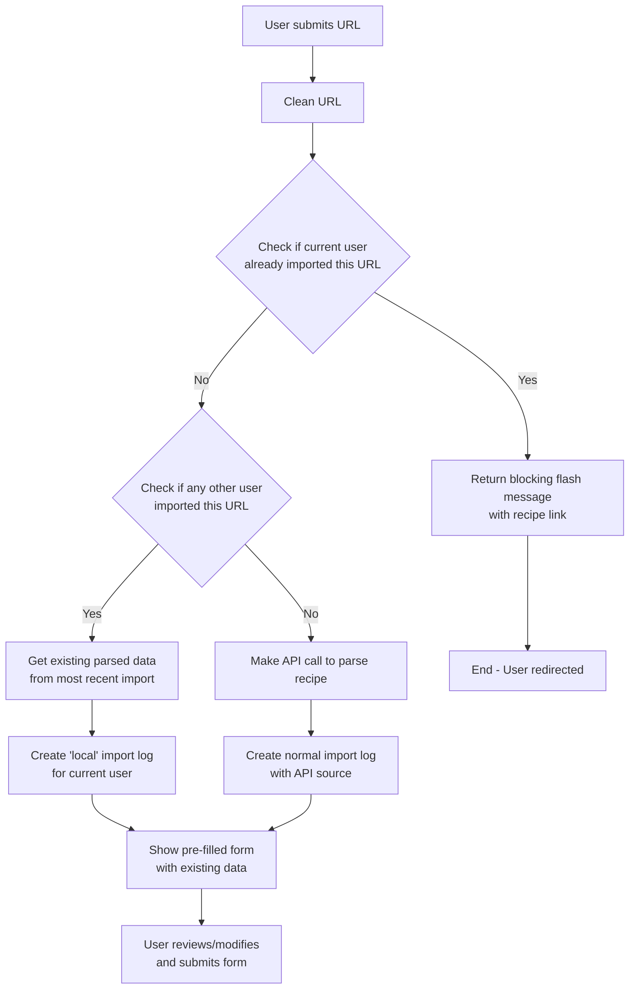

# Recipe Import Duplicate Detection - Implementation Plan

## Overview
Implement duplicate detection for recipe imports to prevent unnecessary API calls and handle user experience appropriately when recipes have been previously imported.

## Requirements Summary
1. Check `import_logs` table before making API requests during recipe import
2. Use recipe URL as the reference for duplicate detection
3. Never return records with source 'local' when checking for existing imports
4. Always return the newest import when multiple exist
5. Handle three scenarios:
   - **New import**: No existing import found → proceed with normal API parsing
   - **Current user duplicate**: Current user already imported this URL → show blocking flash message with recipe link
   - **Other user duplicate**: Another user imported this URL → reuse parsed data, create 'local' log entry, show pre-filled form

## Database Changes

### Migration: Add 'local' to source enum
- Create migration to modify `import_logs.source` column
- Add 'local' to existing enum values: `['structured-data', 'firecrawl', 'open-ai', 'local']`
- 'local' source indicates data was reused from another import (no new API call made)

## Service Layer Changes

### ImportLogService Enhancements

#### New Methods:

1. **`getLastNonLocalImportForUrl(string $url): ?ImportLog`**
   - Find most recent import for URL excluding 'local' source
   - Used to find original parsed data from actual API calls
   - Returns null if no non-local imports exist

2. **`createLocalImportLog(string $url, User $user, array $parsedData): ImportLog`**
   - Create new import log with source 'local'
   - Used when reusing another user's parsed data
   - Stores same parsed_data but for current user

#### Modified Methods:

1. **Update `getLastImportForUrl()`**
   - Add filter to exclude 'local' source records
   - Ensure we only find original imports, not derived ones

## Controller Logic Changes

### ImportController.create() Flow



### Detailed Implementation Steps:

1. **Duplicate Check Logic in `create()` method:**
   ```php
   // Check if current user already imported this URL
   if ($this->importLogService->hasUserImportedUrl($user, $url)) {
       $existingImport = $this->importLogService->getImportLogsForUser($user)
           ->where('url', FileHelper::cleanUrl($url))
           ->first();
       
       if ($existingImport->recipe) {
           return back()->with('info', 
               'Je hebt dit recept al geïmporteerd: <a href="' . 
               route('recipes.show', $existingImport->recipe->slug) . 
               '">' . $existingImport->recipe->title . '</a>'
           );
       }
   }

   // Check if another user imported this URL
   $existingImport = $this->importLogService->getLastNonLocalImportForUrl($url);
   if ($existingImport) {
       // Reuse existing parsed data
       $parsedData = new ParsedRecipeData(...$existingImport->parsed_data);
       
       // Create local import log
       $importLog = $this->importLogService->createLocalImportLog(
           $url, $user, $existingImport->parsed_data
       );
       
       return Inertia::render('Import/Form', [
           'url' => $url,
           'recipe' => new ImportResource($parsedData->toArray()),
           'import_log_id' => $importLog->id,
       ]);
   }

   // Proceed with normal API parsing...
   ```

## Testing Strategy

### Unit Tests for ImportLogService

1. **Test `getLastNonLocalImportForUrl()`:**
   - Returns most recent non-local import
   - Excludes 'local' source records
   - Returns null when only local imports exist
   - Returns null when no imports exist

2. **Test `createLocalImportLog()`:**
   - Creates import log with source 'local'
   - Stores provided parsed data
   - Associates with correct user
   - Sets recipe_id to null initially

### Integration Tests for ImportController

1. **Test duplicate detection scenarios:**
   - Current user already imported: returns flash message
   - Other user imported: shows pre-filled form
   - No previous import: proceeds with API call

2. **Test complete flow:**
   - Import → duplicate detection → form display → recipe creation
   - Verify import logs are created correctly in each scenario

## Error Handling

1. **Missing recipe data**: Handle case where existing import log doesn't have valid parsed_data
2. **Invalid parsed data**: Validate existing parsed data before reuse
3. **Database constraints**: Handle potential conflicts in import log creation

## User Experience Considerations

1. **Flash messages**: Use appropriate styling and clear messaging
2. **Form pre-filling**: Ensure all fields populate correctly from existing data
3. **Performance**: Avoid unnecessary API calls while maintaining good UX

## Implementation Order

1. Create database migration for 'local' source
2. Enhance ImportLogService with new methods
3. Update existing ImportLogService methods
4. Modify ImportController duplicate detection logic
5. Write comprehensive tests
6. Test complete user flows
7. Handle edge cases and error scenarios

## Success Metrics

- Reduced API calls for duplicate URLs
- Clear user feedback for already-imported recipes
- Seamless experience when reusing existing parsed data
- Comprehensive test coverage for all scenarios